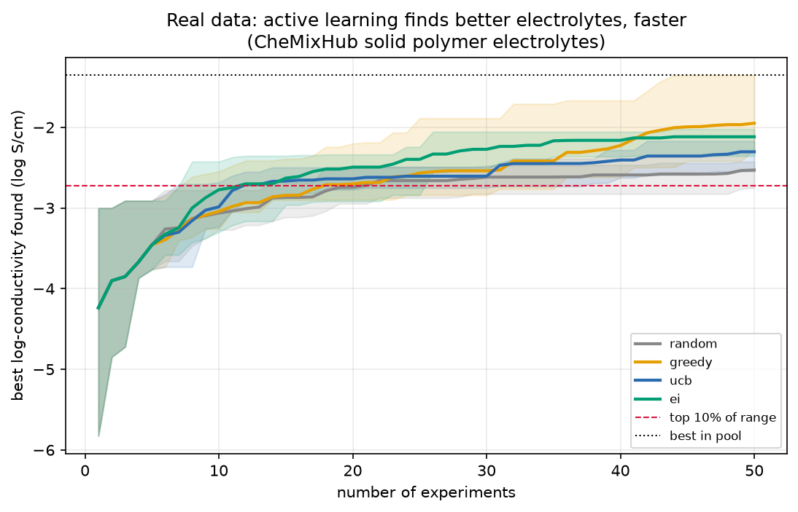

# formulate

**Active learning for polymer formulation — find the best material in the fewest experiments.**


&nbsp;·&nbsp; MIT &nbsp;·&nbsp; Python 3.10–3.12

An industrial ML chemist doesn't have 100,000 labelled samples — they have a design
space and a budget for forty experiments. The job isn't fitting a model to data you
have; it's *choosing which experiments to run*. This is that loop: a surrogate model
and an acquisition function propose the next formulation to make, an oracle scores
it, the model updates, and it repeats under a hard budget — with the whole apparatus
kept property-agnostic, so it runs on synthetic and real data alike.

## The result that matters

On **real, measured data** — 6,949 solid-polymer-electrolyte conductivities
(CheMixHub, MIT), i.e. the search for better **battery electrolytes**:



| strategy | experiments to reach the top 10% of conductivity |
|:---|---:|
| random screening | 28 |
| **UCB / EI** (active learning) | **~12** |

**Active learning finds a top-decile electrolyte in ~11–14 experiments; random
screening needs 28 — a 2.5× reduction on real, literature-measured data.** That's
the difference between a two-week and a five-week experimental campaign. The gap is
smaller than on a clean synthetic oracle (below), which is exactly what honest real
data looks like — noisier surface, less certain surrogate — and reporting it *as*
2.5× is the point.

## Run it

```bash
git clone https://github.com/DrGregPitch/formulate && cd formulate
uv venv && uv pip install -e ".[dev]"     # pulls polytools + copolybench from GitHub

python scripts/fetch_spe.py               # real battery-electrolyte data (MIT)
python scripts/run_spe.py --outdir results
```

`pytest tests -v` runs the suite. For the controlled demonstration below, run
`python scripts/run_optimization.py` instead.

## What's inside

The loop is four swappable pieces — and because they're property-agnostic, pointing
the whole thing at a new problem is *one new design-space builder*:

- **Design space** (`design_space.py`, `real_data.py`) — a pool of candidate
  formulations and an oracle that scores them; the loop counts each score as an
  expensive experiment.
- **Surrogate** (`surrogate.py`) — a Gaussian process, or the
  [`polytools`](https://github.com/DrGregPitch/polytools) gradient-boosting ensemble.
  Returns a mean *and an uncertainty* — what acquisition needs.
- **Acquisition** (`acquisition.py`) — `random`, `greedy`, `ucb`, `ei`. The lesson:
  the specific one matters less than *using the surrogate's uncertainty to choose at
  all*.
- **Loop** (`loop.py`) — seed → propose → measure → update, tracking the best found.
- **Cost-aware mode** — divide acquisition score by a candidate's cost to reach the
  target for less total *spend*, not just fewer runs.

## The controlled demonstration

With a synthetic oracle where the optimum is known exactly (1,440 copolymer
formulations), the win is starker: **active learning reaches within 2% of the best
possible formulation in ~16 experiments; random screening doesn't get there in 60.**
The controlled version proves the method; the real SPE campaign proves it survives
contact with messy measured data.


## Part of a three-project portfolio

This is where the three repos compose into one system:

- [**polytools**](https://github.com/DrGregPitch/polytools) — honest evaluation harness + property models (the surrogate).
- [**copolybench**](https://github.com/DrGregPitch/copolybench) — copolymer representation study + a controlled oracle.
- **formulate** (this repo) — active learning over that space (the campaign).

## Limitations

Pool-based selection over a fixed candidate library, not continuous optimization
with a trust region. Single objective — real formulation is multi-objective (Tg *and*
processability *and* cost); cost is handled as an acquisition constraint, a full
Pareto front is the natural extension. The SPE conductivities are literature-measured
(real) but sparse; the synthetic oracle is controlled, labelled as such.

## License

MIT
