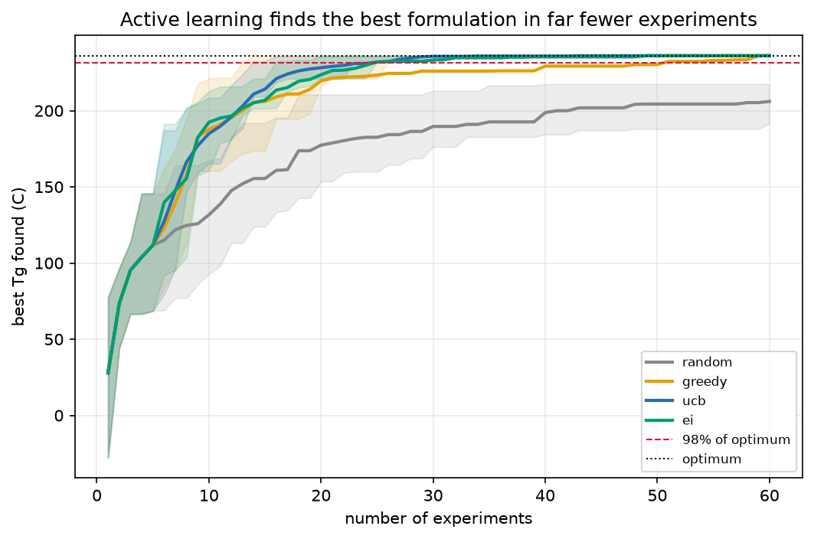

# formulate

**Active learning for polymer formulation: find the best copolymer in the fewest experiments.**


An industrial ML chemist does not have 100,000 labelled samples. They have a design space and a budget for forty experiments. The job is not to fit a model to data you already have — it is to *choose which experiments to run*. This repo is that loop: a surrogate model and an acquisition function propose the next formulation to synthesise, an oracle scores it, the model updates, and it repeats under a hard experimental budget.



That gap is the entire value proposition. On a design space of 1,440 candidate copolymer formulations, **active learning reaches within 2% of the best possible formulation in about 16 experiments. Random screening does not reach it in 60.** Cutting an experimental campaign from months to weeks is a slide a hiring manager can show their director.

---

## The headline result

| strategy | experiments to reach 98% of the optimum |
|:---|---:|
| random screening | **> 60** (never, within budget) |
| greedy (pure exploitation) | 18 |
| **UCB** (upper confidence bound) | **16** |
| EI (expected improvement) | 20 |

*Median over 20 restarts. Design space: 1,440 copolymer formulations; best achievable Tg 236 °C.*

Every active-learning strategy — whether it exploits greedily or balances exploration with UCB/EI — reaches the target 3–4× faster than random, and random often does not reach it at all within the budget. The specific acquisition function matters less than the fact of *using the surrogate's uncertainty to choose*.

---

## How it works

The loop is four pieces, each swappable:

- **Design space** (`design_space.py`) — a pool of candidate copolymer formulations, each defined by a comonomer pair, a composition, and a sequence (blockiness). The **oracle** is the controlled copolymer-Tg model from [`copolybench`](https://github.com/DrGregPitch/copolybench): cheap to call here, but the loop *pretends each call is an expensive synthesis-and-measure experiment and counts them*.
- **Surrogate** (`surrogate.py`) — a Gaussian process (scikit-learn), or the [`polytools`](https://github.com/DrGregPitch/polytools) gradient-boosting ensemble. Returns a mean *and an uncertainty* at every candidate, which is what acquisition needs.
- **Acquisition** (`acquisition.py`) — `random`, `greedy`, `ucb`, `ei`. Given the surrogate's predictions over the unqueried pool, score each candidate; the loop runs the argmax.
- **Loop** (`loop.py`) — seed with a few random experiments, then propose → measure → update until the budget is spent, tracking the best formulation found.

The surrogate sees interpretable design coordinates — the two homopolymer Tgs, the comonomer polarities, the composition, and the sequence statistics — enough to model the property surface but not the hidden per-pair junction term, so it is *good but imperfect*: exactly the regime where choosing experiments well pays off.

## Cost-aware acquisition

Not all experiments cost the same — exotic comonomers are expensive to source. The loop's cost-aware mode (`cost_aware=True`) divides the acquisition score by a candidate's cost, so it prefers cheaper experiments of comparable promise and reaches the target for **less total spend**, not just fewer runs. The optimization script draws this comparison automatically.


---

## Reproduce it

```bash
git clone https://github.com/DrGregPitch/formulate && cd formulate
uv venv && uv pip install -e ".[dev]"      # pulls polytools and copolybench from GitHub
uv run python scripts/run_optimization.py --outdir results   # regenerates the money plot
uv run pytest tests -v
```

One command reproduces every number and both figures.

---

## Where this sits in the portfolio

This is Project 3 of three, and it composes the other two into the loop an industrial ML chemist actually runs:

- [`polytools`](https://github.com/DrGregPitch/polytools) — the honest evaluation harness and property-prediction models (the surrogate).
- [`copolybench`](https://github.com/DrGregPitch/copolybench) — the copolymer representation study and the controlled Tg oracle (the "lab").
- **`formulate`** — active learning over that space (the campaign).

## Limitations

- **Controlled oracle, not experimental data.** The Tg comes from a known model, so this measures the *loop's* efficiency, not agreement with a real lab. Point the design space at real measured data and the same loop runs unchanged.
- **Pool-based.** The loop selects from a fixed candidate pool rather than optimising a continuous design space with a trust region; the pool is large enough to make the point, and pool-based selection matches how a real candidate library is screened.
- **Single objective.** Real formulation is multi-objective (Tg *and* processability *and* cost). Cost is handled as a constraint on acquisition; a full Pareto-front treatment is the natural extension.

## License

MIT
