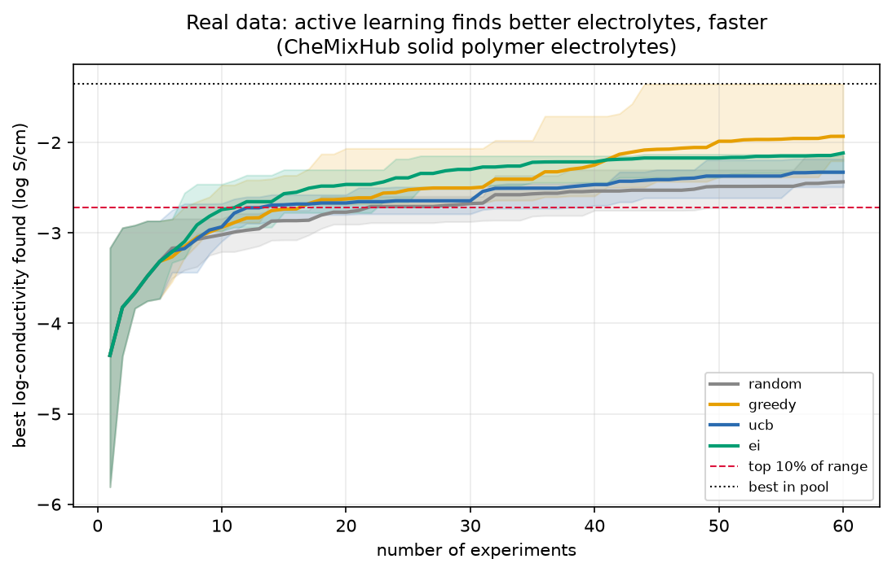
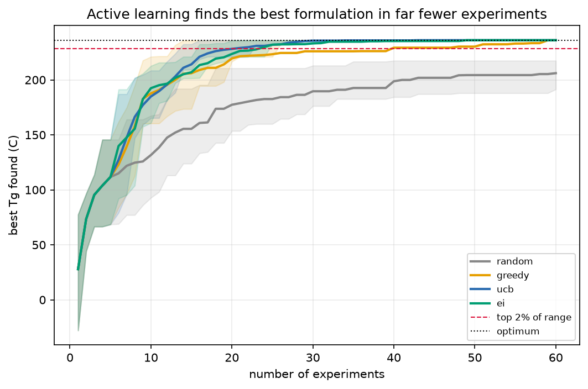

# formulate

**Active learning for polymer formulation — find the best material in the fewest experiments.**


&nbsp;·&nbsp; MIT &nbsp;·&nbsp; Python 3.10–3.12

An industrial ML chemist doesn't have 100,000 labelled samples — they have a design
space and a budget for forty experiments. The job is choosing which experiments to
run, not fitting a model to data already in hand. This is that loop: a surrogate
model and an acquisition function propose the next formulation to make, an oracle
scores it, the model updates, and it repeats under a fixed budget. The apparatus is
property-agnostic, so it runs on synthetic and real data alike.

## The result

On measured data — 6,949 solid-polymer-electrolyte conductivities (CheMixHub, MIT),
i.e. the search for better battery electrolytes:



| strategy | experiments to reach within 10% of the best conductivity |
|:---|---:|
| random screening | 30 |
| **EI / greedy / UCB** (active learning) | **~10–13** |

Active learning reaches within 10% of the best measured conductivity in ~10–13
experiments; random screening needs 30, so roughly a 3× reduction (median over 20
restarts; `python scripts/run_spe.py --restarts 20`). The gap is smaller and noisier
than on the synthetic oracle below — a rougher surface and a less certain surrogate.

## Run it

```bash
git clone https://github.com/DrGregPitch/formulate && cd formulate
uv venv && uv pip install -e ".[dev]"     # pulls polytools + copolybench from GitHub

python scripts/fetch_spe.py               # real battery-electrolyte data (MIT)
python scripts/run_spe.py --outdir results
```

`pytest tests -v` runs the suite. For the controlled demonstration below, run
`python scripts/run_optimization.py` instead.

## What's inside

The loop is four swappable pieces. Because they are property-agnostic, moving to a
new problem means writing one new design-space builder:

- **Design space** (`design_space.py`, `real_data.py`) — a pool of candidate
  formulations and an oracle that scores them; the loop counts each score as an
  expensive experiment.
- **Surrogate** (`surrogate.py`) — a Gaussian process, or the
  [`polytools`](https://github.com/DrGregPitch/polytools) gradient-boosting ensemble.
  Returns a mean and an uncertainty, which is what acquisition needs.
- **Acquisition** (`acquisition.py`) — `random`, `greedy`, `ucb`, `ei`. Which one is
  chosen matters less than using the surrogate at all: plain greedy exploitation of
  its mean beats random and ties the uncertainty-aware strategies.
- **Loop** (`loop.py`) — seed → propose → measure → update, tracking the best found.
- **Cost-aware mode** — divide acquisition score by a candidate's cost to reach the
  target for less total spend, not just fewer runs.

## The controlled demonstration

With a synthetic oracle where the optimum is known exactly (1,440 copolymer
formulations), the margin is larger: active learning reaches within 2% of the best
possible formulation in ~16 experiments, and random screening does not get there in
60. The SPE campaign above is the same method on measured data.



## Part of a three-project portfolio

The three repos compose into one system:

- [**polytools**](https://github.com/DrGregPitch/polytools) — honest evaluation harness + property models (the surrogate).
- [**copolybench**](https://github.com/DrGregPitch/copolybench) — copolymer representation study + a controlled oracle.
- **formulate** (this repo) — active learning over that space (the campaign).

## Limitations

Pool-based selection over a fixed candidate library, not continuous optimization
with a trust region. Single objective — real formulation is multi-objective (Tg *and*
processability *and* cost); cost is handled as an acquisition constraint, a full
Pareto front is the natural extension. The SPE conductivities are literature-measured
(real) but sparse; the synthetic oracle is controlled, labelled as such.

## License

MIT
